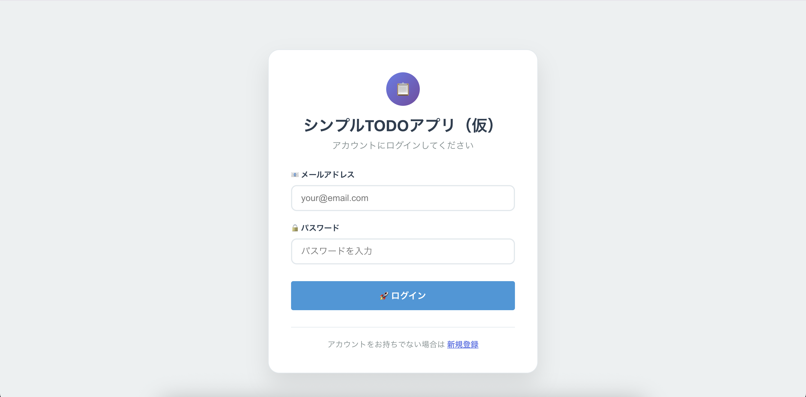
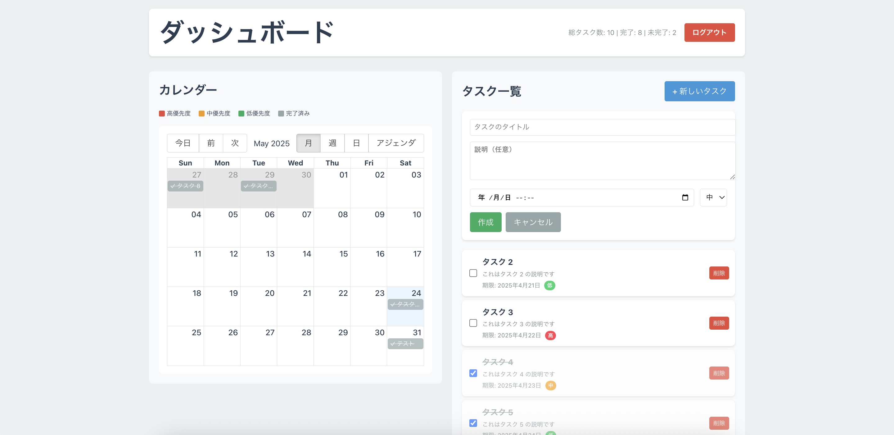

# TODOアプリ（仮）

**シンプルなタスク管理アプリケーション**

シンプルTODOアプリ（仮）は、React + TypeScriptフロントエンドとRuby on Railsバックエンドで構築された、タスク管理システムです。

## ✨ 主な機能

- 🔐 **JWT認証システム** - 安全なユーザー認証とセッション管理
- 📝 **タスク管理** - 作成、編集、削除、完了状態の管理
- 📅 **カレンダービュー** - react-big-calendarを使用した直感的なカレンダー表示
- 🎯 **優先度設定** - 高・中・低の3段階優先度システム

## 🛠️ 技術スタック

### フロントエンド
- **React 19.0.0** - モダンなUIライブラリ
- **TypeScript** - 型安全な開発
- **Vite** - 高速なビルドツール
- **React Router DOM** - クライアントサイドルーティング
- **Axios** - HTTP通信ライブラリ
- **React Big Calendar** - カレンダーコンポーネント
- **Moment.js** - 日付操作ライブラリ

### バックエンド
- **Ruby 3.4.3** - プログラミング言語
- **Rails 8.0.2** - Webアプリケーションフレームワーク
- **PostgreSQL** - リレーショナルデータベース
- **JWT** - JSON Web Token認証
- **BCrypt** - パスワードハッシュ化
- **RSpec** - テストフレームワーク

### 開発・デプロイ
- **Docker & Docker Compose** - コンテナ化
- **Git** - バージョン管理

## スクリーンショット





## 🚀 クイックスタート

### 前提条件

- **Node.js** 22.14.2以上
- **Ruby** 3.4.3
- **PostgreSQL** 13以上
- **Docker & Docker Compose** (推奨)

### 🐳 Docker を使用した簡単セットアップ（推奨）

```bash
# リポジトリをクローン
git clone https://github.com/yamato3010/rails-react-todo.git
cd yamanote-task-manager
```

以下の環境変数を設定
```
POSTGRES_PASSWORD=password
POSTGRES_USERNAME=postgres
```

```
# Docker Composeでアプリケーションを起動
docker-compose up --build

# アクセス
# フロントエンド: http://localhost:5173
# バックエンドAPI: http://localhost:3000
```

### 💻 ローカル開発環境のセットアップ

#### バックエンド（Rails API）

```bash
cd backend

# 依存関係をインストール
bundle install

# データベースをセットアップ
rails db:create db:migrate db:seed

# サーバーを起動
rails server
# => http://localhost:3000 で起動
```

#### フロントエンド（React）

```bash
cd frontend

# 依存関係をインストール
npm install

# 開発サーバーを起動
npm run dev
# => http://localhost:5173 で起動
```

## 🧪 テスト

### バックエンドテスト

```bash
cd backend

# 全テストを実行
bundle exec rspec

# 特定のテストファイルを実行
bundle exec rspec spec/requests/auth_spec.rb

# カバレッジレポートを生成
bundle exec rspec --format documentation
```

## 📁 プロジェクト構造

```
yamanote-task-manager/
├── backend/                 # Rails API
│   ├── app/
│   │   ├── controllers/     # APIコントローラー
│   │   ├── models/          # モデル
│   │   └── lib/             # JWT認証ライブラリ
│   ├── config/              # Rails設定
│   ├── db/                  # データベース関連
│   └── spec/                # RSpecテスト
├── frontend/                # React アプリケーション
│   ├── src/
│   │   ├── components/      # Reactコンポーネント
│   │   ├── api/             # API通信
│   │   ├── types/           # TypeScript型定義
│   │   └── utils/           # ユーティリティ関数
│   ├── public/              # 静的ファイル
│   └── package.json         # npm設定
├── docker-compose.yml       # Docker設定
└── README.md               # このファイル
```

## 📖 使用方法

### 1. アカウント作成とログイン

1. アプリケーションにアクセス
2. 「新規登録」をクリック
3. 必要な情報を入力してアカウントを作成
4. ログイン画面でメールアドレスとパスワードを入力

### 2. タスクの管理

#### タスクの作成
- ダッシュボードの「新しいタスク」ボタンをクリック
- タイトル、説明、期限、優先度を設定
- 「作成」ボタンで保存

#### タスクの編集
- タスクリストでタスクをクリック
- 詳細画面で編集ボタンをクリック
- 必要な項目を変更して保存

#### タスクの完了
- タスクリストのチェックボックスをクリック
- または詳細画面で完了ボタンをクリック

### 3. カレンダービュー

- ダッシュボードのカレンダーでタスクを視覚的に確認
- 月、週、日、アジェンダビューの切り替えが可能
- タスクをクリックして詳細を表示

## 📄 ライセンス

このプロジェクトは [MIT License](LICENSE) の下で公開されています。
